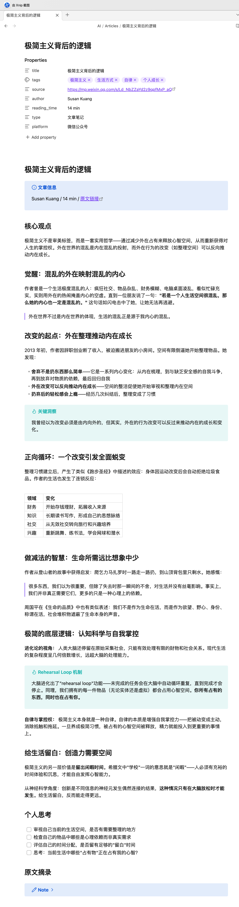
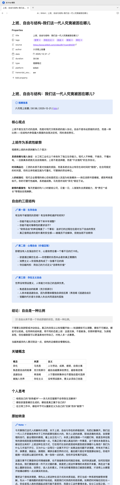

# skill-pack

A curated collection of skills for AI coding assistants, compatible with Claude Code, Codex CLI, OpenCode, and OpenClaw.

[中文文档](README_zh.md)

## Skills

| Skill | Description |
|-------|-------------|
| [article-to-note](skills/article-to-note/SKILL.md) | Convert web articles to Obsidian notes via Defuddle or web_reader |
| [article-to-anki](skills/article-to-anki/SKILL.md) | Convert web articles to Anki cards (Markdown format, import-ready) |
| [video-to-note](skills/video-to-note/SKILL.md) | Convert YouTube / Bilibili videos to Obsidian notes via subtitles or ASR |

## Installation

### One-click install (auto-detect installed tools)

```bash
curl -fsSL https://raw.githubusercontent.com/LjyYano/skill-pack/main/install.sh | bash
```

### Install for a specific tool

```bash
# Claude Code
curl -fsSL https://raw.githubusercontent.com/LjyYano/skill-pack/main/install.sh | bash -s -- --claude

# Codex CLI
curl -fsSL https://raw.githubusercontent.com/LjyYano/skill-pack/main/install.sh | bash -s -- --codex

# OpenCode
curl -fsSL https://raw.githubusercontent.com/LjyYano/skill-pack/main/install.sh | bash -s -- --opencode

# OpenClaw
curl -fsSL https://raw.githubusercontent.com/LjyYano/skill-pack/main/install.sh | bash -s -- --openclaw

# Install all
curl -fsSL https://raw.githubusercontent.com/LjyYano/skill-pack/main/install.sh | bash -s -- --all
```

### Manual install

```bash
cp -r skills/video-to-note  ~/.claude/skills/
cp -r skills/article-to-note ~/.claude/skills/
cp -r skills/article-to-anki ~/.claude/skills/
```

## Examples

### article-to-note

```sh
/article-to-note https://mp.weixin.qq.com/s/Ld_NbZZaYd2z9qpfMxP_aQ
```

> Paste an article URL → the skill extracts the content automatically → outputs a structured Obsidian note.

<details>
<summary>Screenshot</summary>



</details>

### article-to-anki

```sh
/article-to-anki https://mp.weixin.qq.com/s/Ld_NbZZaYd2z9qpfMxP_aQ
```

> Paste an article URL → the skill extracts the content → splits into independent knowledge cards → outputs Markdown Anki card files.

### video-to-note

```sh
/video-to-note https://www.bilibili.com/video/BV1rxqmBhE91/
```

> Paste a Bilibili video URL → the skill uses built-in subtitles if available; otherwise, downloads audio and uses Alibaba Cloud ASR → outputs a structured Obsidian note.

<details>
<summary>Screenshot</summary>



</details>

#### ASR Configuration (required when subtitles are unavailable)

When a video has no subtitles, the skill uses Alibaba Cloud DashScope's `qwen3-asr-flash` model for speech recognition. An API Key is required.

**1. Get your API Key**

Go to [Alibaba Cloud DashScope Console](https://bailian.console.aliyun.com/) → Avatar (top-right) → **API-KEY** → Create and copy.

**2. Set the environment variable**

```bash
# Current session only
export ALIYUN_API_KEY="sk-xxxxxxxxxxxxxxxxxxxx"

# Persistent (add to shell config)
echo 'export ALIYUN_API_KEY="sk-xxxxxxxxxxxxxxxxxxxx"' >> ~/.zshrc
source ~/.zshrc
```

> **Note:** After setting environment variables in Claude Code, you need to restart Claude Code for them to take effect.

**3. Verify the configuration**

```bash
echo $ALIYUN_API_KEY
```

Non-empty output means the configuration is successful.

**Other dependencies (required for ASR path)**

```bash
# macOS
brew install yt-dlp ffmpeg

# Verify
yt-dlp --version
ffmpeg -version
```

## Skill Directories

| Tool | Skills Directory |
|------|-----------------|
| Claude Code | `~/.claude/skills/` |
| Codex CLI | `~/.codex/skills/` |
| OpenCode | `~/.opencode/skills/` |
| OpenClaw | `~/.openclaw/skills/` |
